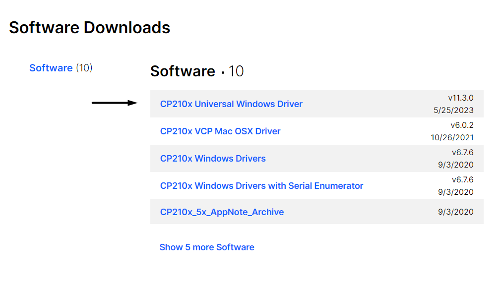

<p align="center">
  <br>
</p>

#

### **SMARTLAB: Armazenamento Inteligente de Produtos Termolábeis** - Faculdade UNISATC (SC) <p>

#### <u>Código fonte responsável por gerir todas as funcionalidades presentes no refrigerador inteligente desenvolvido pela SMARTLAB.</u>

#

## # Hardware Necessário

* Microcontrolador ESP32 OLED
* Pastilha Peltier
* 2 Coolers (exaustor e ventilador)
* Dissipador Térmico
* Regulador de Tensão LM7805
* Sensor de Temperatura e Umidade DHT11
* Rele (5V)
* Protoboard
* Botão
* LED RGB
* Buzzer Ativo (5V)
* 2 Capacitores de 100uF
* 2 Resistores de 330R
* 1 Resistor de 4k7R
* 1 Resistor de 15kR
* Cabos para conexão

#

## # Diagrama Esquemático

<p align="center">
  <br>
</p>

#

## # Preparação do Ambiente
<p>

### Para executar esse código, foi utilizado a [IDE do Arduino](https://www.arduino.cc/en/software) com algumas personalizações, nas quais são:

<br>

* URL adicional inserida nas preferências da IDE, fazendo assim possível utilizar a biblioteca do ESP32 OLED
```
https://dl.espressif.com/dl/package_esp32_index.json
```

<p align="center">
  <br>
</p>

* Donwload e instalação do [driver de comunicação serial](https://www.silabs.com/developers/usb-to-uart-bridge-vcp-drivers?tab=downloads) da placa do ESP32 OLED

<p align="center">
  <br>
  Donwload do driver CP210
</p>

* Instalação do driver responsável pelo gerenciamento do ESP32 OLED, onde basta ir em Ferramentas > Placa > Gerenciador de Placas > pesquisar por "ESP32" e instalar.

<p align="center">
  <br>
  Instalando o Driver do ESP32
</p>

* Seleção da placa do ESP32 OLED em Ferramentas > Placa > esp32 > WEMOS LOLIN32. Após esse passo, é necessário selecionar a porta USB onde seu ESP32 OLED está plugado em Ferramentas > Porta > (<u>sua entrada USB</u>)

<p align="center">
  <br>
  Seleção da placa na IDE
</p>

* Por fim, a instalação das bibliotecas utilizadas no projeto, no qual podem sem encontradas em Ferramentas > Gerenciador de Bibliotecas.

<p align="center">
  <br>
  Instalação de Bibliotecas
</p>

#

## # Finalizando

### Após todos esses passos, basta enviar o código contido nesse repositório para o ESP32 OLED com todos os seus respectivos componentes conectados e aproveitar o que existe de mais inteligente no segmento termolábil de armazenamento refrigerado.

#